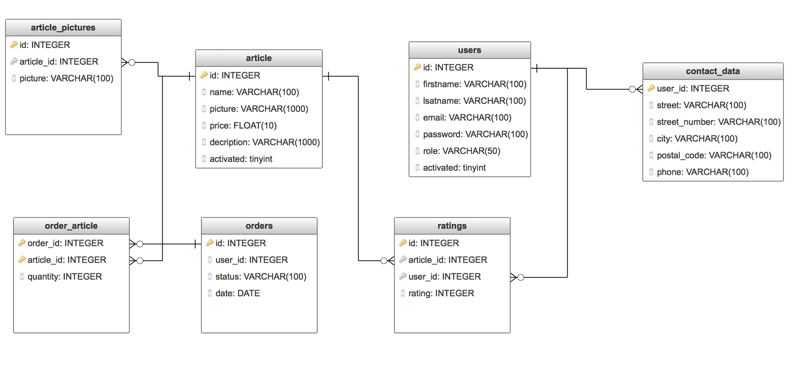

# Spletna trgovina - Elektronsko poslovanje
Install Apache, PHP, MySQL and other requirements
by following [these instructions](https://www.digitalocean.com/community/tutorials/how-to-install-linux-apache-mysql-php-lamp-stack-on-ubuntu-20-04).
```shell
# Clone this project to your local computer's /var/www/
cd /var/www
git clone git@github.com:lukatavcer/spletna-trgovina-ep.git

sudo chown -R $USER:$USER /var/www/spletna-trgovina-ep

sudo vim /etc/apache2/sites-available/spletna-trgovina-ep.conf
# Add this to the spletna-trgovina-ep.conf
<VirtualHost *:80>
    ServerName localhost
    ServerAlias www.spletnatrgovinaep
    ServerAdmin webmaster@localhost
    DocumentRoot /var/www/spletna-trgovina-ep
    ErrorLog ${APACHE_LOG_DIR}/error.log
    CustomLog ${APACHE_LOG_DIR}/access.log combined
</VirtualHost>
# Close and save with ;wq

sudo a2ensite spletna-trgovina-ep
sudo a2dissite 000-default
sudo apache2ctl configtest
sudo systemctl reload apache2

# Visit http://localhost/ in browser.
```


## Podatkovna baza

```shell
sudo mysql -u root
# Delete the existing root user and create a new one.
DROP USER 'root'@'localhost';

# Disable password policy if installed.
UNINSTALL COMPONENT 'file://component_validate_password';
CREATE USER 'root'@'localhost' IDENTIFIED BY 'root';
GRANT ALL PRIVILEGES ON *.* TO 'root'@'localhost' WITH GRANT OPTION;
FLUSH PRIVILEGES;

CREATE DATABASE ep_db;
exit

# Import the database from the .sql file
cd /var/www/spletna-trgovina-ep/api/db
mysql -h localhost -u root -p ep_db < ep_db.sql
```

- **servername**: localhost
- **db name**: ep_db
- **username**: root
- **password** root

**Administrator:**
- **firstname**: Admin
- **lastname**: Administratovic
- **email**: admin@admin.com
- **password**: admin1
  
**Prodajalec:**
- **firstname**: Prodajalec
- **lastname**: Ep
- **email**: pe@gmail.com
- **password**: eptest
    
**Stranka:**
- **firstname**: Ep
- **lastname**: Test
- **email**: ep@gmail.com
- **password**: eptest



# Zahteve za e-trgovino

## Dodatni komentarji
* [x]  Secret token ob POST requestih
* [x]  Serviranje slik, pravice: `"chmod -R 777 /home/ep/NetBeansProjects/<ime_mape_projekta>"` 

## Vloge uporabnikov

V seminarski nalogi izdelajte model spletne prodajalne z uporabo tehnologij Linux, Apache, SUPB MySQL, PHP, SSL, certifikatov X.509 in mobilne platforme Android.

Spletna prodajalna naj ima naslednje uporabnike, pri katerih hranite spodaj navedene atribute.

* [x]  `Administrator`: Ime, Priimek, Elektronski naslov in geslo
* [x]  `Prodajalec`: Ime, Priimek, Elektronski naslov in geslo
* [x]  `Stranka`: Ime, Priimek, Elektronski naslov, Naslov, Telefonska številka, geslo
* [x]  `Anonimni odjemalec`, pri katerem ne hranite atributov

## Osnovne storitve

Osnovne storitve prodajalne naj podpirajo naslednje operacije pri vsaki vlogi.
Spletni vmesnik vloge `Administrator`

Vmesnik naj omogoča:

* [x]  Prijavo in odjavo. Dostop je dovoljen le odjemalcem, ki se overijo s pomočjo certifikatov X.509
* [x]  Posodobitev lastnega gesla in ostalih atributov
* [x]  Ustvarjanje, aktiviranje in deaktiviranje uporabniškega računa `Prodajalec` ter posodobitev njegovih atributov

V vlogi administratorja imate lahko zgolj enega uporabnika, ki ga lahko kreirate ročno, denimo z uporabo določene skripte, vmesnika phpmyadmin in podobno.

### Spletni vmesnik vloge `Prodajalec`

Vmesnik naj omogoča:

* [x]  Prijavo in odjavo. Dostop je dovoljen le odjemalcem, ki se overijo s pomočjo certifikatov X.509
* [x]  Posodobitev lastnega gesla in ostalih atributov
* [x]  Obdelavo naročil. Slednje obsega
    * [x]  Pregled še neobdelanih naročil in njihovih postavk. Posamezno naročilo se prodajalcu prikaže šele, ko `Stranka` z nakupom zaključi
    * [x]  Potrjevanje ali preklic oddanih naročil
    * [x]  Ogled zgodovine potrjenih naročil in možnost storniranja potrjenih naročil
* [x]  Ustvarjanje, aktiviranje in deaktiviranje artiklov in posodabljanje njihovih atributov. Pri obravnavi artiklov lahko upravljanje z zalogami izpustite. Z drugimi besedami -- v aplikaciji lahko vedno predpostavite, da je na zalogi dovolj artiklov
* [x]  Ustvarjanje, aktiviranje in deaktiviranje uporabniških računov tipa `Stranka` in posodabljanje njegovih atributov

### Spletni vmesnik vloge `Stranka`

Vmesnik naj omogoča:

* [x]  Prijavo in odjavo
* [x]  Posodobitev lastnega gesla in ostalih atributov
* [x]  Nakupovanje. To naj bo sestavljeno iz
    * [x]  Pregledovanja artiklov trgovine
    * [x]  Dodajanja in odstranjevanja artiklov v košarico ter spreminjanja količine v košarici
    * [x]  Zaključka nakupa. Tu se naj stranki prikaže povzetek kupljenih izdelkov s predračunom. Ko stranka naročilo potrdi, se to doda v čakalno vrsto neobdelanih naročil, kjer ga lahko v obravnavo prevzame `Prodajalec`
* [x]  Dostop do seznama preteklih nakupov. Uporabnik lahko vidi vsa svoja pretekla naročila: oddana, potrjena in stornirana
* [x]  Uporaba vmesnika `Stranka` je dovoljena le preko zavarovanega kanala. Odjemalca overite z uporabniškim imenom in geslom, ki naj bosta shranjena v SUPB

### Spletni vmesnik anonimnega odjemalca

Vmesnik naj omogoča:

* [x]  Pregledovanje artiklov preko spletnega vmesnika
* [x]  Registracijo preko spletnega vmesnika
* [x]  Uporaba vmesnika anonimnega odjemalca je dovoljena preko javnega in zavarovanega kanala, pri registraciji pa nujno preklopite na zavarovan kanal. V splošnem poskrbite za ustrezno preklapljanje med omenjenima kanaloma

### Vmesnik mobilne aplikacije (platforma Android)

Izdelajte Android aplikacijo, ki bo omogočala preprosto pregledovanje artiklov v vaši trgovini.

* [x]  Implementirajte vmesnik spletne storitve, preko katerega bo mobilna aplikacija komunicirala z vašo prodajalno
* [x]  Implementirajte funkcionalnost brskanja po artiklih. Implementirajte vsaj dva zaslona
    * [x]  Prvi zaslon naj prikaže seznam vseh artiklov v trgovini
    * [x]  Če uporabnik izbere artikel s zgornjega seznama, naj aplikacija prikaže drug zaslon, kjer se izpišejo podrobnosti artikla

## Ostale zahteve

Vaša rešitev naj zadosti še omenjenim zahtevam:

* [x]  Vzpostavite lastno certifikatno agencijo in z njo izdelajte strežniško digitalno potrdilo. Digitalno potrdilo namestite v strežnik Apache
* [x]  Osebne certifikate izdelajte ročno z namenskim programom in z uporabo iste certifikatne agencije, kot ste jo uporabili za izdelavo strežniškega certifikata. Uporabite smiselna polja certifikata ter na ustrezen način povežite identiteto uporabnika v bazi z identiteto zapisano v certifikatu
* [x]  Pri realizaciji vseh delov prodajalne skrbno preverjajte vnose s strani odjemalca, pri čemer bodite posebej pozorni na napade injekcije kode SQL ter napade XSS
* [x]  Metode protokola HTTP realizirajte v skladu s priporočili standarda HTTP, kjer uporabite zahtevke z metodo GET za lahke operacije, za zahtevnejše pa zahtevke z metodo POST
* [x]  Poskrbite za ustrezno hrambo gesel
* [x]  Izdelan model podatkovne baze naj bo normaliziran do tretje normalne oblike. Vse denormalizacije morajo biti utemeljene

Uspešna realizacija vseh navedenih zahtev prinese 50% ocene, preostalih 50% pridobite z realizacijo izbranih razširjenih storitev.

## Razširjene storitve

Z implementacijo razširjenih storitev lahko zvišate oceno. Pri vsaki storitvi je navedeno, kolikšen delež ocene prinaša. Pri tem je pomembno, da lahko za razširjene storitve dobite največ 50%. Slednje pomeni, da v kolikor izgubite točke pri Osnovnih storitvah, jih z razširjenimi storitvami ne morete kompenzirati.

### Varnost

* [x]  (5%) Vodenje dnevnika uporabnikov `Administrator` in `Prodajalec`
* [x]  (5%) Registracija strank z uporabo filtriranja CAPTCHA

### Uporabniški vmesnik

* [x]  (do 10%) Smiselna organizacija in izvedba uporabniškega vmesnika s pomočjo tehnologij kot so sta CSS in JavaScript. Za polno oceno je nujna tudi uporaba tehnologije AJAX
* [x]  (5%) Implementacija ocenjevanja artiklov prijavljenega uporabnika ter predstavitev njihove povprečne ocene pri njihovem ogledu
* [x]  (10%) Predstavitev artiklov s slikami. Slike lahko shranite v SUPB ali na datotečni sistem. Za polno oceno mora implementacija podpirati dodajanje in spreminjanje slik na enak način kot se spreminjajo ostali atributi artiklov ter možnost, **da za vsak artikel dodamo več slik**


## Končno poročilo

Končno poročilo boste izdelali po predlogi, ki je objavljena v spletni učilnici. V poročilu boste na kratko in jedrnato podali:

* [x]  Seznam implementiranih osnovnih in razširjenih storitev
* [x]  Opis podatkovnega modela, kjer boste pojasnili neočitne in ne-trivialne atribute
* [x]  Opis implementiranih varnostnih mehanizmov
